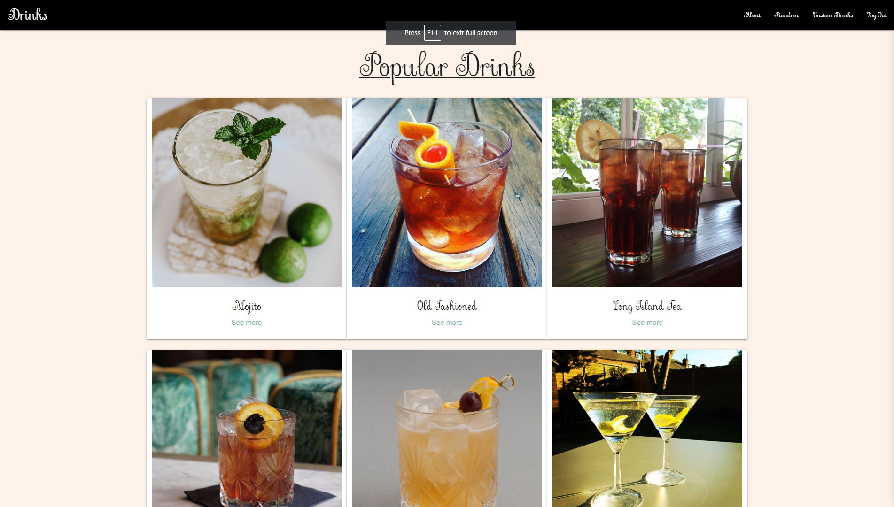
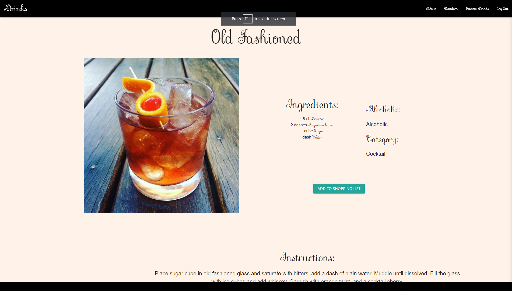
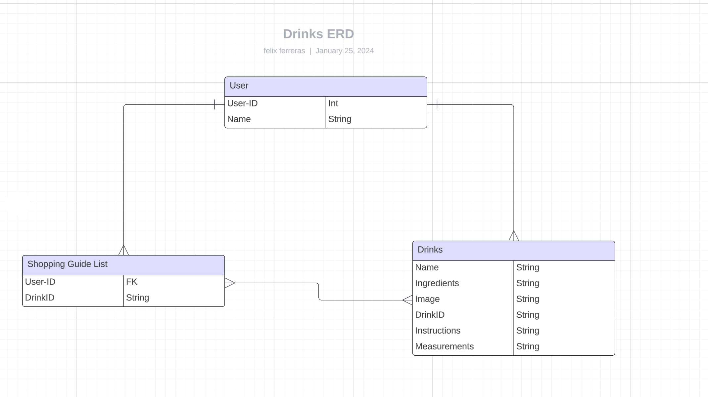

# Drinks-App

Overview
- The drinks app is being created for drink makers and drinkers alike. It's made to educate and ensure that all parties, events and even casual drinks are enjoyed to the fullest. Displaying ingredients, instructions, and being able to save personal favorites is a tool that everyone would find helpful. Now this is meant to be tool and not be abused so please use this tool and drink Responsibly....but Drink !

User Stories
  - As a user, I want the ability to sign up.
  - As a user, I want the ability to sign in. 
  - As a user, I want the ability to sign out.
  - As a user, I want the ability to favorite recipes, and add them to a list.
  - As a user, I want the ability to view all of my recipes in a list. 
  - As a user, I want the ability to read more details of individual recipes. 
  - As a user, I want the ability to delete the recipes in my list. 
  - As a user, I want the ability to delete list 
  - As a user, I want the ability to view the ingredients of the recipes
  - As a user, I want the ability to read all of the recipes I have favorited. 
  - As a user, I want the ability to view different versions of my selected recipes
    
a detailed list of the functionality of your application, told through a user's perspective
Wireframes / Screenshots

## Screenshots

## Entity Relationship Diagrams

